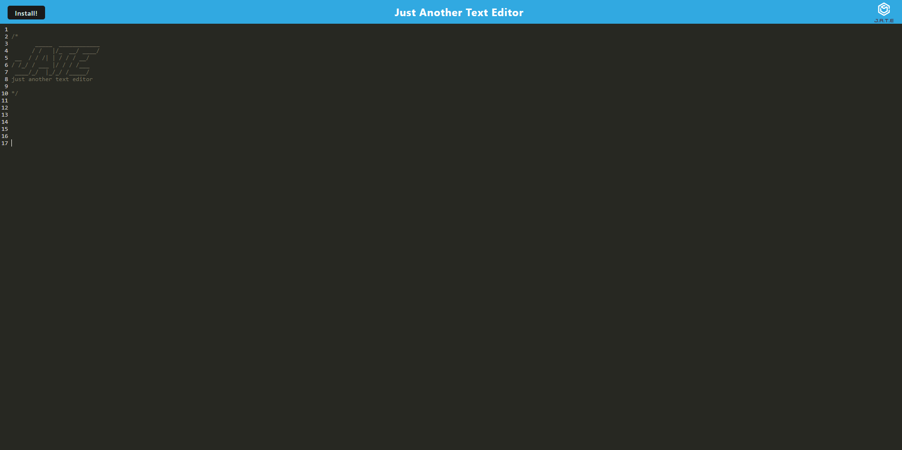

# Slightly-Edited

## Description
Some features of this application.
1. This app can easily be used for editing text in the browser or installed locally.  
2. When the user enters content and subsequently clicks off of the DOM window then the user's content is saved.
3. When the user reopens the application then the content in the text editor has been retrieved from our IndexedDB for easy editing.

---

## Table of content

* [Description](#description)

* [Usage](#usage)

* [How to Contribute](#how-to-contribute)

* [Links](#links)

* [Questions](#questions)

* [Pictures](#pictures)

---

## Usage

Text Editor. 

## How to Contribute

Pull requests. Feel free to open a pull requst on my GitHub.

## Questions

If you have any questions about this project then you can contact me directly at 

elizabethdberube@gmail.com

----

## Links

[GitHub Repo](https://vast-sea-43373.herokuapp.com/) 

[Deployed Application](https://github.com/elizabethdberube/Slightly-Edited) 

----

## Pictures

